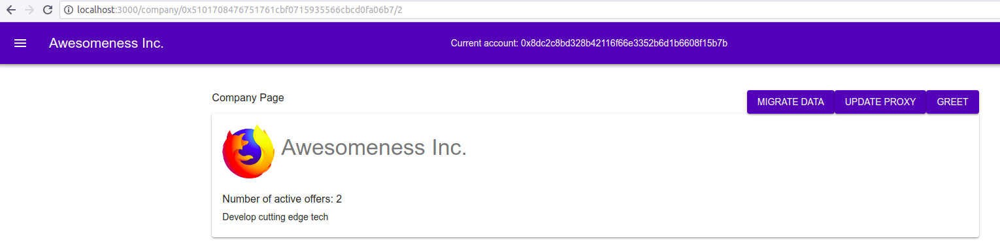

# Recruitment Dapp

The Recruitment Dapp is a decentralized application that
allows companies post their job offers along a specific
reward in Ether. 

Candidates who like the company and the job offers they 
post can apply to one or several job offers and in case
they got selected for the job, they can claim the associated
with the job offer reward.

## General Overview

The repository contains two folders that hold the backend and
frontend projects, respectively.

### Backend

As you can see in the `contracts/` folder, there are lots
of contract in it. However, only two contracts (along with a library)
out of those in the contracts directory are getting deployed.
The rest are part of the inheritance chain of the two deployed
contracts that allow for upgrading a contract. We'll get to that
at the end of this file. The deployed entities are:

1. The CompanyFactory.sol contract, for generating
Company contracts for each individual company.
2. The Company.sol contract, for managing the job offers
and applicants for a company.
3. The UtilsLib.sol library for helping computing the
length of the strings.

As you can see, a factory pattern was chosen to be able
to deploy individual contracts for each Company. This
allows for a more simple development flow, as there is
no need to have an additional layer of complexity to
store a mapping with the Company owners and the corresponding
Companies they own.

### Frontend

On the frontend side the tech stack is:

- React (main framework)
- Redux (frontend state management)
- Web3 (injected by MM, for contract management)
- IPFS API (for storing files and info about company)
- Material UI (for making things pretty)

### Stretch Goals

Besides the main course objective (to have a working project),
the following stretch goals are reached:

- project uses IPFS
- project implements an Upgradable Pattern
- project includes an example smart contract in LLL / Vyper
- project is deployed on the rinkeby testnet

## Running a local development server

Please follow the steps described below (in the order they
appear) in order to be able to launch both backend and
frontend projects.

### Running backend project

1. Open a terminal
2. Run `ganache-cli` in order to run a local ethereum node
If you don't have `ganache-cli` installed, check out the
installation guide [here](https://github.com/trufflesuite/ganache-cli)
or simply execute in a terminal `sudo npm install -g ganache-cli`
You should get a similar result (but with different addresses):

3. Open another terminal window
4. cd into the /backend folder of the project (`cd /{path-to-project-folder}/backend)
5. Run `truffle compile`. The project should compile and
create the `build` folder with .json files in it. If you
don't have truffle installed yet, run `sudo npm install -g truffle`
in a terminal window
6. Run `truffle test`. All tests should pass
7. Run `truffle migrate`. It will migrate the required
contracts from the `migrations` folder onto the dev chain.
The output of migrating should be similar to this image:

We are all set with the backend. Now let's proceed with the
frontend environment.

### Running frontend project

This step consists of two intermediate steps:

#### Set up MetaMask

In order to be able to use the project, you'll need MetaMask extension
installed.

1. Copy the `mnemonic` from the terminal window where you have
launched `ganache-cli`

2. In MetaMask (MM), connect to the `Localhost 8545` network

3. Press "Restore from seed phrase"

4. Paste in the mnemonic phrase and set a password

5. Copy a Private Key from the terminal window where you have
launched `ganache-cli`  

6. In MM, select Import Account and paste the private key

7. (Optional) import yet another private key to have 3 accounts in total

We are done with setting up the MM. Now let's move on to the frontend project itself.

#### Set up React project

1. Open a terminal window
2. cd into the /frontend folder of the project (`cd /{path-to-project-folder}/frontend)
3. Run `npm install`
4. Open the `src/constants.js` file and set the `DEPLOYED_COMPANY_FACTORY_ADDRESS`
variable to be equal to the address at which CompanyFactory was deployed:

5. Run `npm run start`
6. Open your browser and navigate to `localhost:3000`

If you followed all instructions, you should see this screen:

## Using the dapp

Click on "Register Company" button. You will be redirected to a form that you
can fill in with details about a specific company. Fill in the company details
and click on "Register" button.

At this moment, the platform uploads the company details to IPFS as a serialized
JSON object and upon finishing the upload, it will ask you to sign a transaction
that will create a new contract on the blockchain. After receiving the event
that indicates a successful contract creation, it will redirect you back to the
main page.

Now, if you didn't switch your active account in MM, it will have administrative
role at the given company.

You can navigate to the company page, where you can create Job Offers.

### Creating Job Offers

The first thing to do before creating a job offer is to make a deposit to increase
the contract's balance, as in the process of creating a job offer, you'll need
to define what reward you are willing to pay out to candidates in case they
are accepted for the job and you need to have that amount already in your
balance.

You can deposit any amount right on the company's page (if you are the person
who have created the company). After that, you can press on "Create Job Offer"
button to be redirected to the corresponding page.

A Job Offer consists of a title, the domain, min and max salary (in USD), the
reward an applicant will get if they are approved for the job and the job
description:

Note that the form has basic input validation and you won't get fancy error
messages if you'll set a negative salary range amount, or any other invalid
values. In case of invalid data it will fail silently, so please use correct
data and everything will work.

### Managing Job Offers

After creating a Job Offer you have several options:

1. **Update.** For this, you need to press on the "Manage" button and update
the editable fields. Note that you cannot update all the fields.
2. **Publish.** This will allow for other people to see the application and
to apply to it. You can change your current account in MM and check that you
cannot see unpublished job offers.
3. **Close.** In case you don't need the offer anymore, or you have found
a candidate through other recruitment channels, you can simply close the
offer and free the associated reward so that you can allocate it to other jobs.

Whenever you are ready, publish a job offer and switch to another account
in MetaMask.

### Applying to Job Offers

As another account (that didn't create the company) you can visualize only
the published offers of a company and apply to them.

In order ot apply for a job offer, upload your resume and press the "Apply"
button. This will upload the file onto IPFS and will save in the blockchain
the hash that corresponds to that file.

*Important!* Currently, the platform works only with files in the .pdf format.
If you'll upload a file in other format, it will upload it correctly, but
when you will want to download it, you'll have to manually change the
extension of the file as by default it is downloaded in pdf.

As a candidate, you can apply to as many opened job offers as you wish.

### Managing Applicants

Switch back to the owner account of a company and navigate to the job offer
that has some applicants (by pressing the "Manage" button on a Job Offer).
You should see a list of addresses that have applied to the given job offer.

Here you can download their applications from IPFS and approve any candidate
that fits better the job offer by pressing on the "Approve" button.

This will cause the job offer to have its status changed from `isOpen = true`
to `isOpen = false` and the selected applicant will be set as the
`approvedApplicant` for the job offer. Now, the person who owns the address
of the `approvedApplicant` can claim the reward that is associated to that
job offer.

## How To Upgrade Contracts

Let's say that we would like to add a new state variable, a `greeting`
that will hold the way the company greets people. Also, we will need
a function that can change that `greeting` variable. And for the sake
of example, we will adjust an existing function (`switchEmergency`) by
emitting an event after it runs. You can find these changes in the
`Company2.sol` contract.

The process of upgrading a contract consists of several steps:

1. Get the address of the deployed base Company contract

2. In the backend folder, move the `3_update_contracts.js` file into
the `migrations` folder
3. Substitute `{insert deployed Company address here}` in
`migrations/3_update_contracts.js` with the address of the deployed
company you got at point 1
4. Run `truffle migrate` to deploy the new contracts
5. Copy the `Company2Update` contract address

6. Assign that address to the `DEPLOYED_COMPANY_UPDATER_ADDRESS`
variable in the `src/constants.js` file

Now, navigate to a company page and append `/2` in the URL of the page.

You should get redirected to the version of the page that allows you
to update the contracts. You can know that by the presence of three
additional buttons: "Migrate Data", "Update Proxy" and "Greet".

If you will try to press on "Greet" before migrating, you will get
a "JSON RPC error" in the console, because the function we try to
call doesn't exist yet on the contract.

The order of migrating is the following:

1. **Migrate Data**. This will initialize the newly added `greeting`
variable to the default `"Welcome!"` value.
2. **Update Proxy**. This updates the address of the proxy contract
to the updated contract (Company2 in our case).
3. **Greet**. Check whether the contract was upgraded. If everything
went correctly, you should see `greeting: err, result null Welcome!`
in the browser's console, which means we have successfully upgraded
our contract!

## Miscellaneous

The active MetaMask address is not present in the screenshots above,
but it was added later and if you run the project yourself, you should
see it in the nav bar.

As there are no standalone contracts in the Recruitment Dapp, I have
written a "King of the Ether" example contract in Vyper that you can
find under `backend/contracts/VyperDemo.vy`
